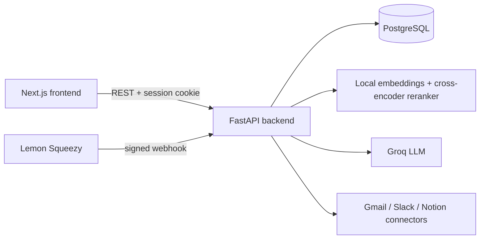

# ThinkDesk

**Find it. Understand it. Get it done.**

[](https://github.com/saad92005/thinkdesk/actions/workflows/backend-tests.yml)
[](https://github.com/saad92005/thinkdesk/actions/workflows/frontend-checks.yml)

**Live:** [thinkdesk-three.vercel.app](https://thinkdesk-three.vercel.app)

ThinkDesk is a multi-tenant AI knowledge workspace. Upload documents, ask
questions, and get evidence-backed answers with citations. You can also
compare documents, research a topic across your whole knowledge base, and
let AI agents take actions, but only after you approve them.

This is not "chat with your PDF". It is a knowledge, AI and automation
platform, built in stages. See [docs/roadmap.md](docs/roadmap.md) for the
full plan and [docs/architecture.md](docs/architecture.md) for how the
pieces fit together.

## Architecture



## What works today

**Retrieval and answers (Phases 1–2)**
- Upload a PDF. It is extracted, chunked and embedded locally (no API key needed).
- Query rewriting: the LLM rewrites each question into alternate phrasings to widen recall.
- Hybrid retrieval: vector search and BM25 keyword search, fused with Reciprocal Rank Fusion, then reranked with a local cross-encoder.
- Grounded answers with citations from Groq. Chat history is saved and browsable.
- RAG evaluation runs against your own documents and reports real retrieval-hit scores plus LLM-judged faithfulness and relevance scores.

**Document intelligence and research (Phases 3–4)**
- Grounded two-document comparison: similarities, differences and contradictions.
- Key-fact extraction, and synthesized reports across up to 5 documents.
- Research mode across the entire knowledge base. A finding is marked `verified` only when two or more separate documents independently support it. That label is computed, not the LLM's opinion of its own confidence.

**Integrations, agents and automation (Phases 5–7)**
- Gmail and Slack via OAuth, and Notion via a direct integration token. All three share one connector architecture and are read-only by default.
- A propose → review → approve → execute agent loop. The agent drafts an email summary or a document digest, you edit it, and nothing reaches Slack until you click "Approve & post".
- Saved automation rules reuse the same logic. They only ever queue drafts for approval and never post on their own.

**SaaS foundations (Phase 8)**
- Organizations, invites, roles and member management per workspace.
- Lemon Squeezy checkout. Billing status changes only from a signature-verified webhook, never from the client. This has been proven with a real test-mode purchase.
- Free-plan limits (3 documents, 50 chat messages) are enforced on the server, not just displayed.

**Quality**
- 105 pytest tests cover the features above, including tenant isolation: one organization's data cannot be reached by another.
- A landing page, a shared design system (`frontend/src/components/ui/`), and light/dark themes.

### Known gaps

- `pgvector` is compiled and vendored but not yet installed into the running Postgres instance, so a Python similarity fallback is used for now. See [docs/roadmap.md](docs/roadmap.md).
- Billing uses **Lemon Squeezy**, not Stripe, because Stripe doesn't support Pakistan-based accounts.

## Stack

- **Frontend:** Next.js, TypeScript, React, Tailwind CSS
- **Backend:** Python, FastAPI, Pydantic
- **Database:** PostgreSQL + pgvector
- **Infra:** Docker / Docker Compose

## Getting started

See [docs/setup.md](docs/setup.md) for full instructions. Quick version:

```
cp .env.example .env
docker compose up --build
```

Or run the frontend and backend individually without Docker — see the setup
doc for details.

## Project structure

```
thinkdesk/
  frontend/    Next.js app (landing page, auth, workspaces, documents, chat)
    src/components/ui/  Shared design system (Button, Card, Input, etc.)
  backend/     FastAPI app
    app/       auth, organizations, documents, ai, retrieval, chat
    migrations/  Alembic
    tests/     pytest suite
    vendor/    pgvector, compiled from source, pending install
  docs/        Architecture, setup, roadmap, security
  docker-compose.yml
  .env.example
```

## Documentation

- [Architecture](docs/architecture.md)
- [Setup](docs/setup.md)
- [Deployment](docs/deployment.md) — free, public HTTPS deploy (Render + Vercel)
- [Roadmap](docs/roadmap.md)
